# Contrôle-JEE

## 1. Schéma de l'architecture technique

## 2. Diagramme de classe

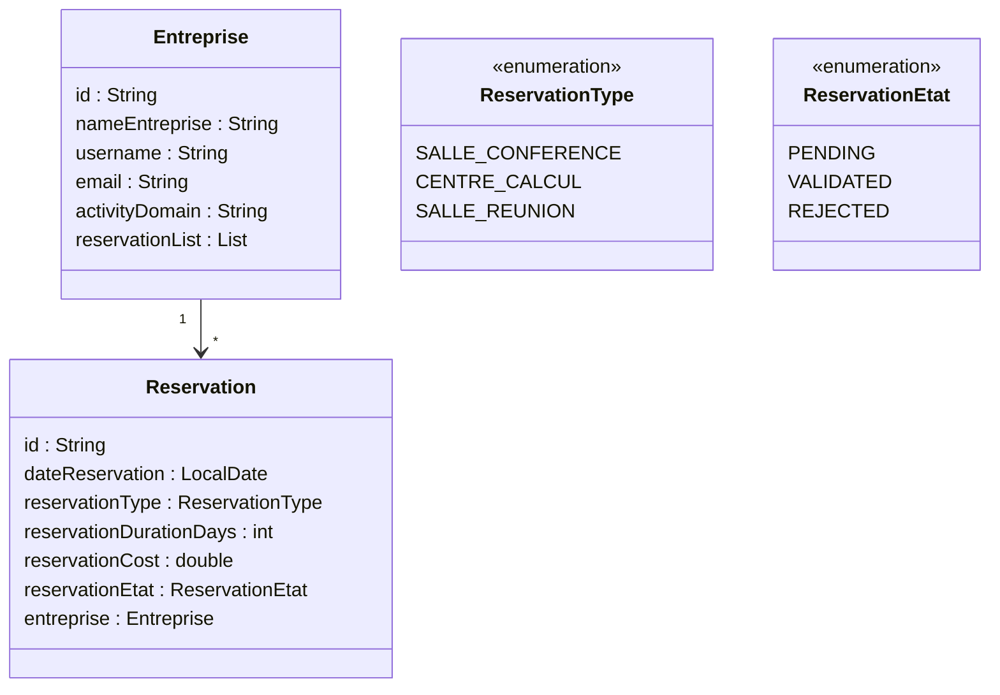

## 3. Couche DAO

#### Screenshots DATABASE

### a. Entités JPA

```java
@Entity
@Data
@NoArgsConstructor
@AllArgsConstructor
@Builder
public class Reservation {
    @Id
    @GeneratedValue(strategy = GenerationType.UUID)
    private String id;
    private LocalDate dateReservation;
    private ReservationType reservationType;
    private int reservationDurationDays;
    private double reservationCost;
    private ReservationEtat reservationEtat;
    @ManyToOne
    private Entreprise entreprise;
}

public enum ReservationType {
    SALLE_CONFERENCE, CENTRE_CALCUL, SALLE_REUNION
}

public enum ReservationEtat {
    PENDING,VANLIDATED, REJECTED
}

```

```java
@Entity
@Data
@NoArgsConstructor
@AllArgsConstructor
@Builder
public class Entreprise {
    @Id @GeneratedValue(strategy = GenerationType.UUID)
    private String id;
    private String nameEtreprise;
    private String username;
    private String email;
    private String activityDomain;
    @OneToMany(mappedBy = "entreprise", cascade = CascadeType.ALL)
    @Builder.Default
    List<Reservation> reservationList = new ArrayList<>();
}
```

### b. Interface JPARepository`

```java
public interface ReservationRepository extends JpaRepository<Reservation, String> {
}

public interface EntrepriseRepository extends JpaRepository<Entreprise, String> {
}
```

### c. Test des couches DAO

#### Création

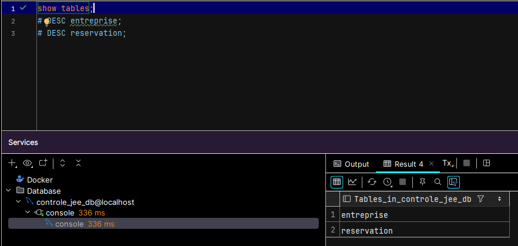

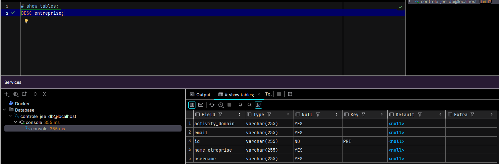

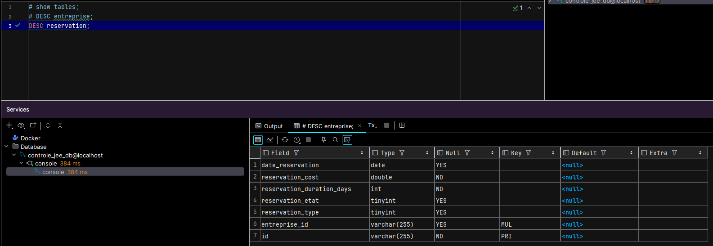

#### Ajout

```java
  @Bean
    CommandLineRunner run(EntrepriseRepository entrepriseRepository, ReservationRepository reservationRepository) {
        return args -> {
            System.out.println("Application Started Successfully with args: " + Arrays.toString(args));

            List<Entreprise> entrepriseList = EntrepriseSample.getSampleEntreprises();
            Entreprise entreprise1 = entrepriseList.get(0);
            Entreprise entreprise2 = entrepriseList.get(1);

            List<Reservation> reservationList = ReservationSample.getSampleReservations();
            Reservation reservation1 = reservationList.get(0);
            Reservation reservation2 = reservationList.get(1);
            Reservation reservation3 = reservationList.get(2);

            entreprise1.getReservationList().add(reservation1);
            entreprise1.getReservationList().add(reservation2);
            reservation1.setEntreprise(entreprise1);
            reservation2.setEntreprise(entreprise1);

            entreprise2.getReservationList().add(reservation3);
            reservation3.setEntreprise(entreprise2);


            entrepriseRepository.saveAll(List.of(entreprise1, entreprise2));

            entrepriseRepository.findAll().forEach(entreprise ->
            {
                System.out.println("Entreprise: ");
                System.out.println(entreprise.getId());
                System.out.println(entreprise.getNameEtreprise());
            });

            reservationRepository.findAll().forEach(reservation ->
            {
                System.out.println("Reservation: ");
                System.out.println(reservation.getId());
                System.out.println(reservation.getReservationDurationDays());
            });
        };
```

```bash
Entreprise:
b5f70352-5bca-4701-9749-2f4b65fa36cc
TechCorp
Entreprise:
e83b4452-8bf4-4e1e-9ba9-9f56c45a3a38
HealthPlus
Hibernate: select r1_0.id,r1_0.date_reservation,r1_0.entreprise_id,r1_0.reservation_cost,r1_0.reservation_duration_days,r1_0.reservation_etat,r1_0.reservation_type from reservation r1_0
Hibernate: select e1_0.id,e1_0.activity_domain,e1_0.email,e1_0.name_etreprise,e1_0.username from entreprise e1_0 where e1_0.id=?
Hibernate: select e1_0.id,e1_0.activity_domain,e1_0.email,e1_0.name_etreprise,e1_0.username from entreprise e1_0 where e1_0.id=?
Reservation:
b607e277-7047-42a7-a566-03d08e57be0f
3
Reservation:
bb186ef4-2588-41a0-917c-69fbefc97422
5
Reservation:
dfd86393-3a2d-4900-b30a-b3539f6e9a4d
5
```

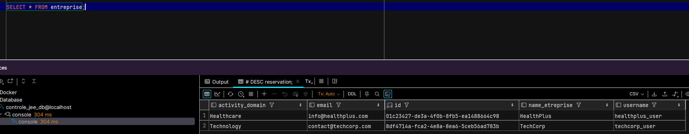
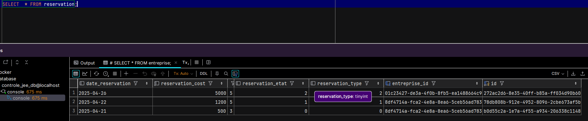

## 4. CoucheWeb

### a. Controllers

### b. Thymeleaf

#### Index Pages

Reservation
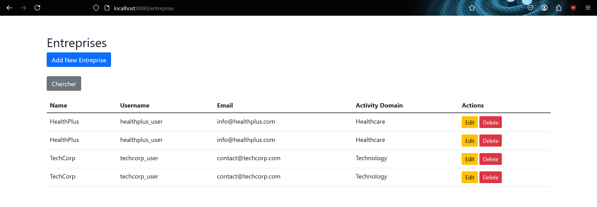
Entreprises
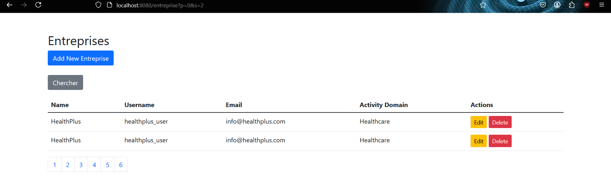

#### Pagination

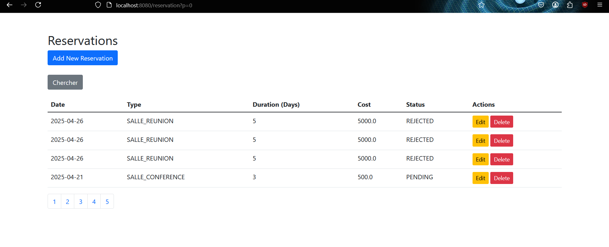
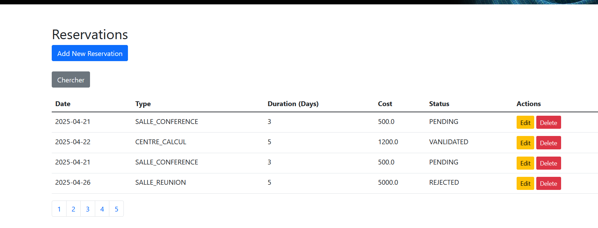
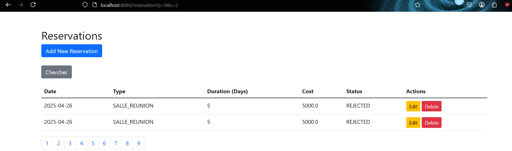

#### Recherche

ENTREPRISE
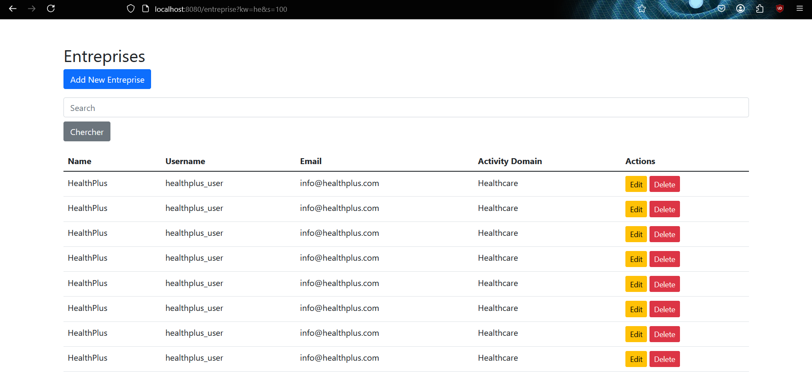

RESERVATION
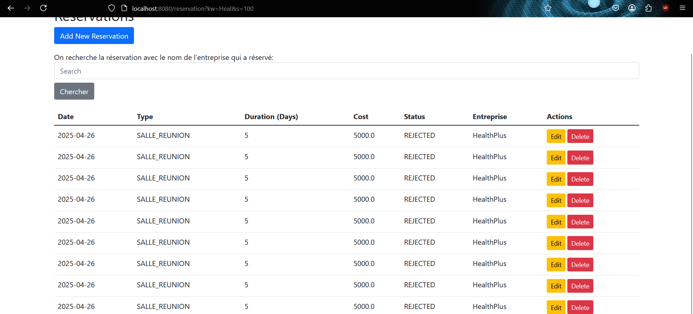
