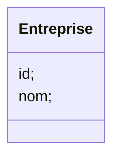

# Contrôle-JEE

## 1. Schéma de l'architecture technique

## 2. Diagramme de classe

## 3. Couche DAO

#### Screenshots DATABASE

### a. Entités JPA

### b. Interface JPARepository

### c. Test des couches DAO
